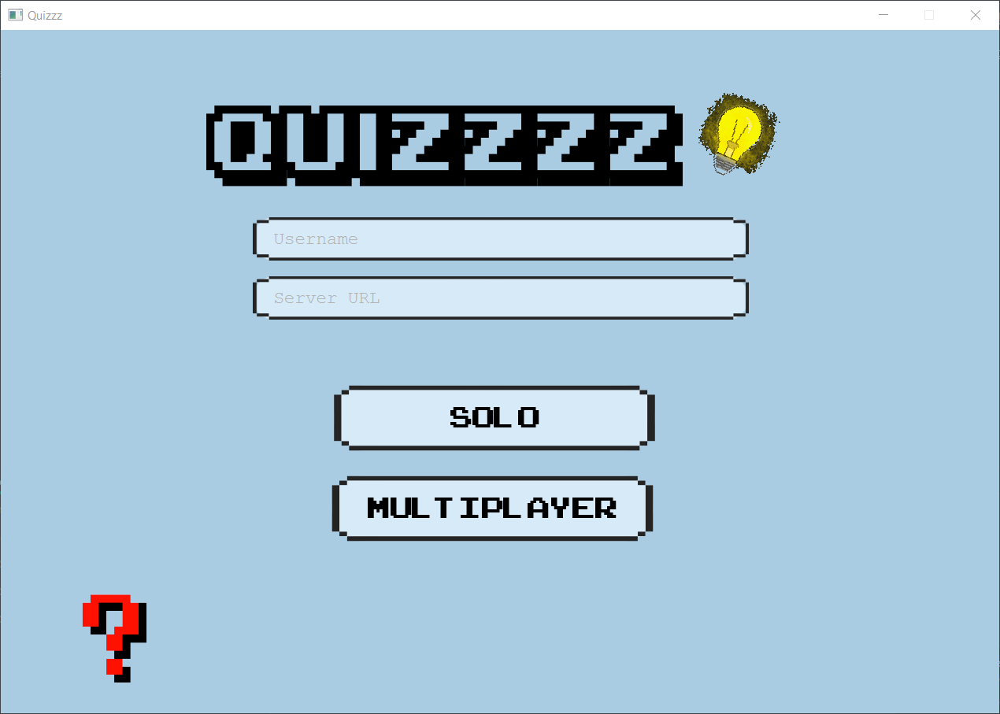
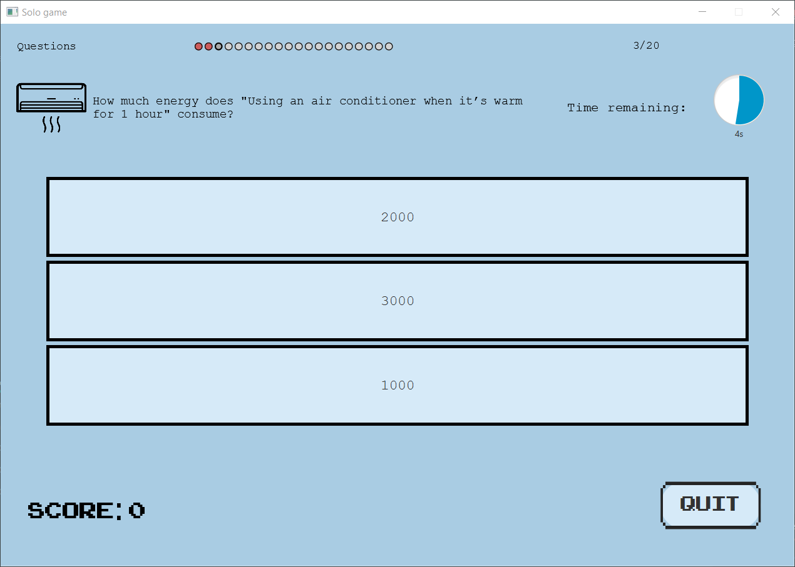
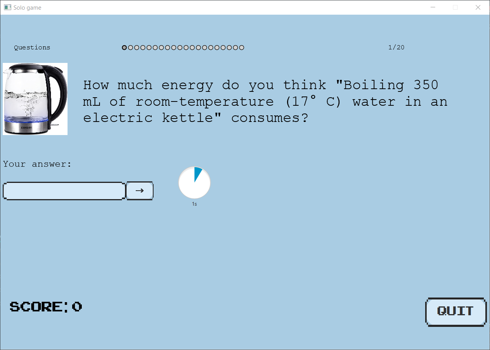
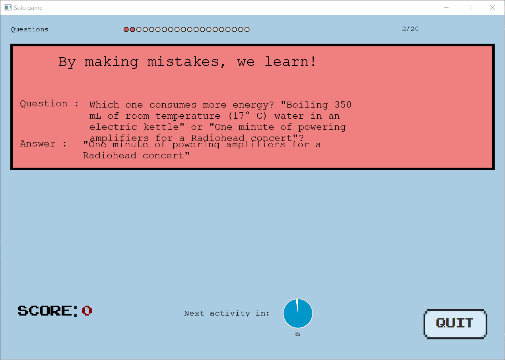
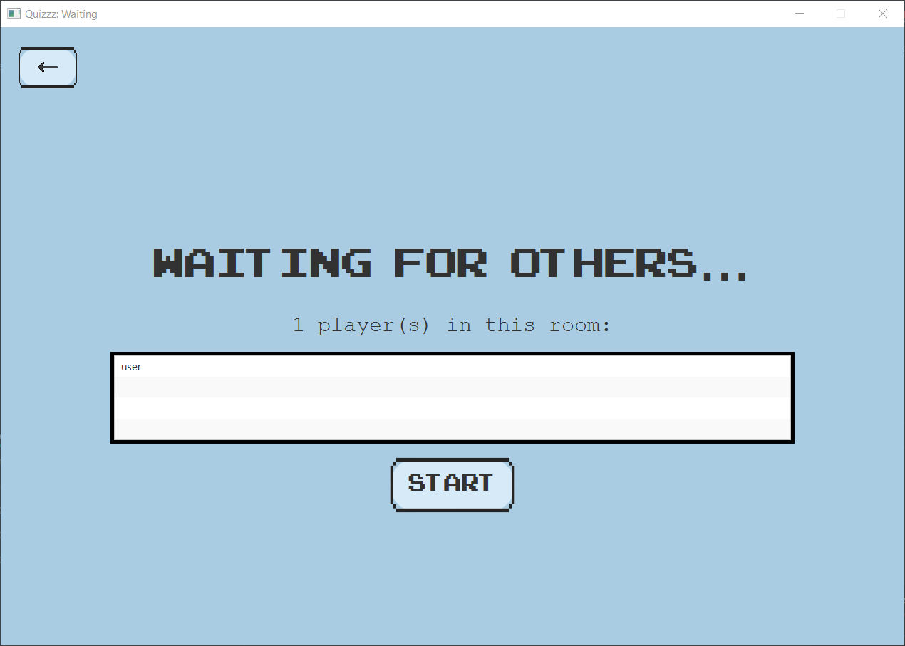
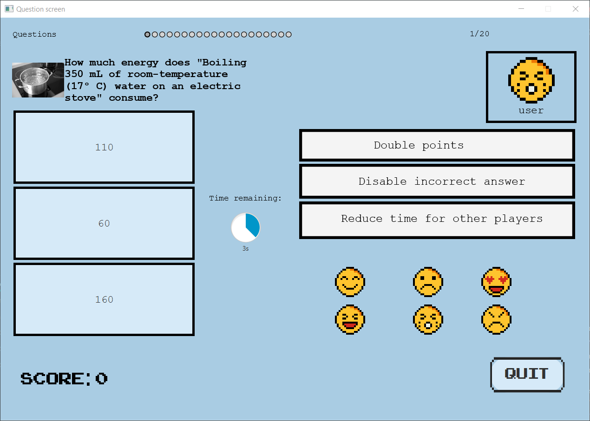
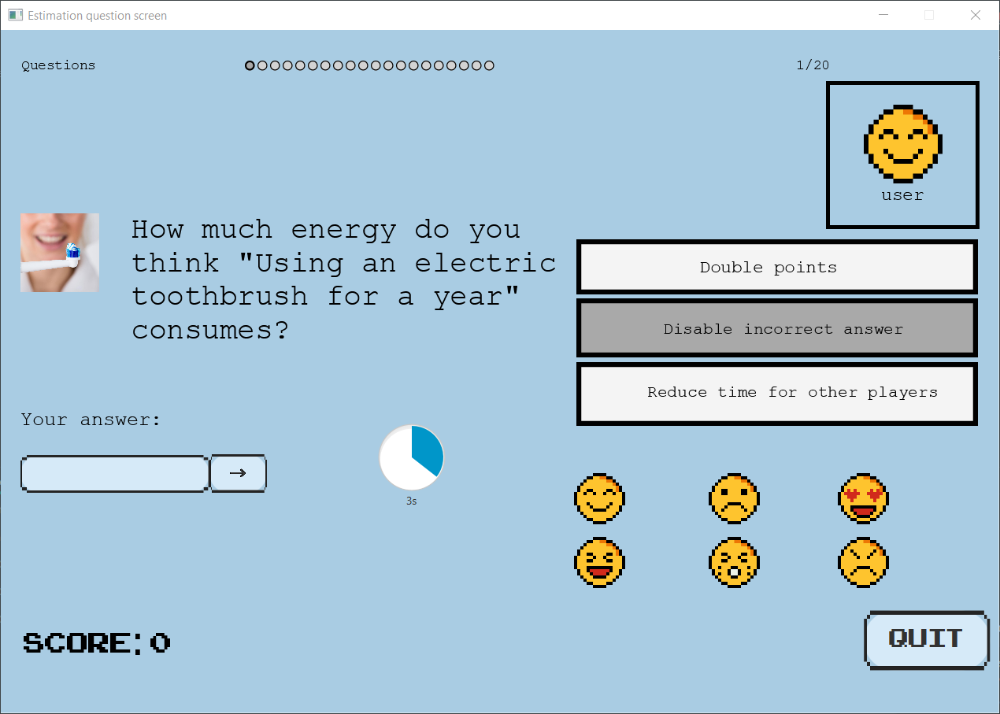
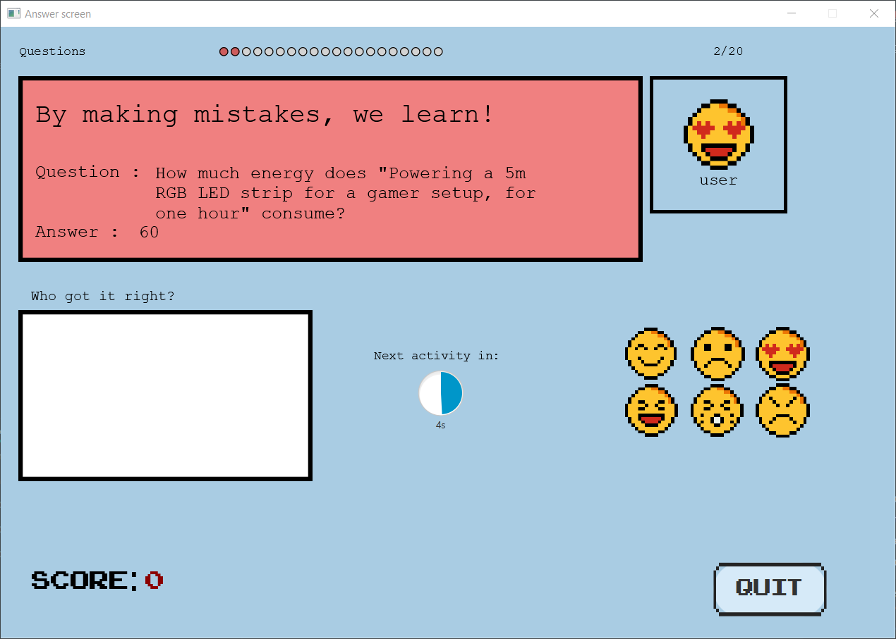

# Starting template

This README will need to contain a description of your project, how to run it, how to set up the development environment, and who worked on it.
This information can be added throughout the course, except for the names of the group members.
Add your own name (do not add the names for others!) to the section below.

## Description of project

### Product

Quizzzz is a quiz-based desktop game built using
the Spring and JavaFX Java-based application frameworks.
It is a game that is intended to raise awareness
about the energy consumption about various human
activities by presenting them to the user
as interactive questions, which they can use to actively
learn about how much people's lives affect
the finite resources on our planet.

### Components

The game consists of two game modes - solo and multiplayer. Both modes
consist of questions sequentially shown to the player with their answers
in between.

The player can choose the mode they want to play in the application
home page:



Each question is timed, which means that users have a limited time
to answer the question before they are shown the answer. The application
uses regular polling for the visualisation of questions and game statistics.
The polling service is regulated both by the timer on the client-side
and the blocking
endpoints on the server side, which only provide information to the client
when it is ready and respectively indicate to the client that they have to
wait until they receive this information.

#### Question types

There are four question types in our game:

- Consumption question: asks the user how much energy a given activity consumes in terms of Wh and gives them three options presented as buttons on the screen. When an option is clicked, the user's answer is saved, and when the time runs out, the last saved user answer is used for point calculation, ranking, etc.
- Comparison question: asks the user what they could do instead of a given activity and gives them three other activities presented as buttons on the screen.
- Choice question: asks the user which activity of the presented ones consumes more energy in terms of Wh or if their energy consumption is equal. The options are presented as buttons on the screen.
- Estimation question: asks the user to estimate how much energy a given activity consumes in terms of Wh. Users can enter their answer on a text field and click a button to save their answer.

#### Solo

The solo game mode consists of 20 questions and answers sequentially
shown to the user on the relevant application scenes. The solo game
question fetching is implemented using one poll at the beginning of the
game, which receives the whole game state from the server with all
twenty questions and those are then sequentially shown to the client.

The questions in the game state object are generated by the server
in the beginning of the game, when they are requested from the client.
Randomisation is used to choose the question type and activities from the
database for each question, which ensures that each game is fair and
the user has equal chance of getting any activity or question type.

The question modes are visualised on the respective question screens
as described above:

 

A user who answers more consecutive questions correctly
gets a streak, which gives them more points for each consecutive
correctly answered question.

After the time on the given question screen runs out, the user is
shown an answer screen:



After the game ends, the user score is saved on the server and
the user is added to the global solo game ranking. The ranking is
then fetched from the server in the form of a list and displayed as
a table.

#### Multiplayer

The multiplayer game mode is structured in the following way:

When a user opts to play in multiplayer, they are put in a waiting
room for the server that they have chosen on the home page:



Each server has only one waiting room. As soon as a player in a multiplayer
waiting room clicks the start button, all players in that room are removed
from it and put in a game. As in the solo game mode, all questions are
generated after a game has started and put in the game state object.

However, to ensure that the game cycle is synchronized for each player,
questions are fetched from the client one after another using short polling.
After the time on the question screen runs out, the list of correctly answered
users is continuously polled form the server until the server sends a valid response,
indicating that the time has run out for every player in that game.

 

The answer screen contains a list of all users that have answered a question
correctly:



After the 10th question, a ranking screen is shown, which includes a table
with all players in the game ranked by their scores.

After the 20th question, a results' page is shown, which includes a similar
table with all players in the game ranked by their scores.

There are two new features present in the multiplayer game - emojis and jokers.

Emojis are shown to every player in the game and everyone can just click
on an emoji button, which would put the used emoji on the top right of
the screen, along with the username of the player who used it.

Jokers allow players to boost their chances in a multiplayer game, making
the game more competitive. There are three types of jokers:

- The “double points” joker, when activated, doubles the points that you receive for that question.
- The “remove incorrect answer” joker disables one of the incorrect answers to the question. It is unique to the multiple-choice question page.
- The “time attack” joker decreases the time everyone else has to answer the question.

The time attack joker, which affects all other players, and the emojis
which have to be visualised to everyone, are implemented using websockets.
Every client listens for messages only for the game they are currently in and
as soon as they receive a message, they act according to the message contents -
display the emoji or decrease the time for that user if necessary.

## Group members

| Profile Picture | Name | Email |
|---|---|---|
|  | Bink Boëtius| B.J.Boetius@student.tudelft.nl |
|  | Boris Goranov | B.G.Goranov@student.tudelft.nl |
|  | Pál Patrik Varga | VargaPalPatrik@student.tudelft.nl |
|  | Calin | Georgescu-2@student.tudelft.nl | 
|  | Kevin Hoxha | K.Hoxha@student.tudelft.nl |
|  | Alican Ekşi | A.Eksi@student.tudelft.nl |
<!-- Instructions (remove once assignment has been completed -->
<!-- - Add (only!) your own name to the table above (use Markdown formatting) -->
<!-- - Mention your *student* email address -->
<!-- - Preferably add a recognizable photo, otherwise add your GitLab photo -->
<!-- - (please make sure the photos have the same size) --> 

## Dependencies

The project depends on the following libraries
and frameworks:

- [Gradle](https://gradle.org/)
- [Spring](https://spring.io/)
- [JavaFX](https://openjfx.io/)
- [Jackson](https://github.com/FasterXML/jackson)
- [Gson](https://github.com/google/gson)
- [JUnit](https://junit.org/junit5/)
- [Mockito](https://site.mockito.org/)

## How to run it

Clone the project repository and move into
the project by executing
the following git commands on the terminal:

```text
git clone "git@gitlab.ewi.tudelft.nl:cse1105/2021-2022/team-repositories/oopp-group-49/repository-template.git"
cd repository-template
```

If you want to run the project, make sure to have
gradle installed on your machine as a command. Also, you
need to have Java installed on your machine in order
to run the application, as it is built using Java.

You can see how you can install Java on your machine
according to your system specifications [here]().

In case you don't want to install gradle, you can
build the project using the `gradlew` executable file in
the repository.

```text
./gradlew build
```

After a successful build, you should be able to run
the Spring server using the following gradle
command on the terminal:

```text
./gradlew bootRun
```

This should start the server on the default `localhost:8080`
port on your machine. Then, you can start a client
instance from a new terminal using the following command:

```text
./gradlew run
```

This would initialise the JavaFX stage and show
the application client on a new window.

## How to contribute to it

In order to contribute to the project, you can clone
the repository as described in the "How to run it"
section, install the required dependencies and
open your local repository copy in a suitable IDE.

To work on an issue, you need to [create your own issue](https://gitlab.ewi.tudelft.nl/cse1105/2021-2022/team-repositories/oopp-group-49/repository-template/-/issues)
or choose an [active issue](https://gitlab.ewi.tudelft.nl/cse1105/2021-2022/team-repositories/oopp-group-49/repository-template/-/issues) to work on. Be sure
to inform the project maintainers about this.

You can fork the project to your [Gitlab](https://about.gitlab.com/) profile
and start working on your issue in a separate branch.
Branches for issues are named using the following
convention:

```text
issueNumber-issueTitle
```

After completing your issue, be sure to open
a merge request for your branch and the project maintainers
will review it before merging it into the development
branch. Merges to the main application branch happen
regularly under the supervision of the project maintainers.

## Getting started

Here are some guidelines on the project structure to get you started:

### Server

---

The server is built using the Spring Java framework. There are multiple standard component types which provide the necessary functionality to communicate with that server.

REST stands for REpresentational State Transfer, a standardized approach to building web services.

A REST API is an intermediary Application Programming Interface that enables two applications to communicate with each other over HTTP, much like how servers communicate to browsers.

RESTful is the most common approach for building web services because of how easy it is to learn and build.

Main: the main class for a Spring application simply runs that spring application in its main function.

```java
@SpringBootApplication
@EntityScan(basePackages = { "commons", "server" })
public class Main {
	public static void main(String... args) {
		SpringApplication.run(Main.class, args);
	}
}
```

The actual API provides controllers, which are used to implement basic CRUD functionality. Those are stored in the `api` package of the server application.

```java
@RestController
@RequestMapping("/some/url")
public class MyController {
	/* TODO: place object fields and constructor */
	
	@GetMapping("/{id}")
	public String getById(@PathVariable("id") long id) {
		/* TODO: get route functionality */
		return result;
	}

	@PostMapping("/entity")
	public String addEntity(@RequestBody Object obj) {
		/* TODO: post route functionality */
		return result;
	}

	@GetMapping(path = {"", "/"})
	public String getAll() {
		/* TODO: request with multiple mappings */
		return result;
	}
}
```

In Spring, beans are the objects that form the backbone of the application and are managed by the Spring Inversion of Control (IoC) container. A bean is an object that is instantiated, assembled and otherwise managed by a Spring IoC container.

Since objects are managed by an IoC container, dependency injection becomes simple and the application objects are easily maintained and tested.

To create a bean, firstly decorate the object class with a `@Component` annotation:

```java
@Component
public class MyClass {
	/* TODO: standard class body methods */
}
```

Then, the bean is configured using a configuration class supplying the bean metadata to an IoC container:

```java
@Configuration
@ComponentScan(basePackageClasses = MyClass.class)
public class Config {
	@Bean
	public MyClass getMyClass() {
		return new MyClass();
	}
}
```

The configuration class produces a bean of type `MyClass`. It also carries the `@ComponentScan` annotation, which instructs the container to look for beans in the package containing the `MyClass` class.

When the Spring IoC container constructs objects of those types, all the objects are called Spring beans, as they are managed by the IoC container.

### Database

---

Every repository in the database is simply configured as an interface extending the `JpaRepository`.

```java
public interface QuoteRepository extends JpaRepository<Quote, Long> {}
```

### Client

---

The client-side of the application is implemented using the JavaFX framework for developing desktop applications with Java. The structure of the JavaFX project is simply scenes with `fxml` injections for every scene controller, where the scene controller (a Java class) determines the behaviour of the scene (button clicks, events, etc.).

To implement dependency injection using JavaFX, the following project structure is used:

`MyFXML` class with factory build functionality:

```java
public class MyFXML {
	private Injector injector;

	public MyFXML(Injector injector) {
		this.injector = injector;
	}

	public <T> Pair<T, Parent> load(Class<T> String... parts) {
		FXMLLoader loader = new FXMLLoader(getLocation(parts), null, null, new MyFactory(),
			StandardCharsets.UTF_8);
		Parent parent = loader.load();
		T controller = loader.getController();
		return new Pair<>(controller, parent);
	}

	private URL getLocation(String... parts) {
		Path path = Path.of("", parts).toString();
		return MyFXML.class.getClassLoader().getResource(path);
	}

	private class MyFactory implements BuilderFactory, Callback<Class<?>, Object> {
		@Override
		public Builder<?> getBuilder(Class<?> type) {
			return new Builder() {
				@Override
				public Object build() {
					return injector.getInstance(type);
				}
			};
		}

		@Override Object call<?> type) {
			return injector.getInstance(type);
		}
	}
}
```

The `MyModule` class then binds the different controllers as singletons (class that are instantiated only once).

```java
public class MyModule implements Module {
	@Override
	public void configure(Binder binder) {
		binder.bind(MainCtrl.class).in(Scopes.SINGLETON);
		binder.bind(SecondaryCtrl.class).in(Scopes.SINGLETON);
		/* TODO: bind other controllers */
	}
}
```

The `MainCtrl` is responsible for switching between different scenes using key-value pairs in the JavaFX application, which is configured in its `initialize` method.

```java
public class MainCtrl {
	private Stage primaryStage;
	
	private SecondaryCtrl secondaryCtrl;
	private Scene secondary;

	public void initialize(Stage primaryStage, Pair<SecondaryCtrl, Parent> secondary, ...) {
		this.primaryStage = primaryStage;
		this.secondaryController = secondary.getKey();
		this.secondary = new Scene(secondary.getValue());

		showSecondary();
		primaryStage.show();
	}

	public void showSecondary() {
		primaryStage.setTitle("Secondary");
		primaryStage.setScene(secondary);
		/* TODO: additional setup functionality */
	}
}
```

Then for every other controller, we simply provide the necessary functionality for that application screen configuration.

```java
public class SecondaryCtrl implements Initializable {
	private final MainCtrl mainCtrl;
	private final ServerUtils serverUtils;

	@FXML
	private TextField usernameField;

	@Inject
	public SecondaryCtrl(ServerUtils server, MainCtrl mainCtrl) {
		this.server = server;
		this.mainCtrl = mainCtrl;
	}

	@Override
	public void initialize(URL location, ResourceBundle resources) {
		colFirstName.setCellValueFactory(q -> 
			new SimpleStringProperty(q.getValue().person.firstName));
		/* TODO: setup other columns */
	}

	public void openNewController() {
		mainCtrl.showOtherController();
	}
}
```

The application `Main` class then just launches the application by creating loading the FXML resources into the given controllers in its start method.

```java
public class Main extends Application {
	private static final Injector INJECTOR = createInjector(new MyModule());
	private static final MyFXML FXML = new MyFXML(INJECTOR);

	public static void main(String... args) {
		launch();
	}

	@Override
	public void start(Stage primaryStage) {
		Scene secondary = FXML.load(SecondaryCtrl.class, "client", "scenes", "secondary.fxml");
		MainCtrl mainCtrl = INJECTOR.getInstance(MainCtrl.class);
		mainCtrl.initialize(primaryStage, secondary);
	}
}
```

Requests to the server are done in the `ServerUtils` class.

### Commons

---

The commons are usually the objects shared between the server and the client. These are standard Java objects, and should include the `equals`, `hashCode` and the `toString` method implementations.

Database configuration such as column names can be set up using the proper annotations - `@Table`, `@Column`, `@Id` and `@GeneratedValue`.

### Communication

---

#### Polling

Simple polling is implemented by frequent polling from the client to a particular endpoint on the server. Create a timer on the client as follows:

```java
new Timer().scheduleAtFixedRate(new TimerTask() {
	@Override
	public void run() { /*...*/ }
}, POLLING_START, POLLING_INTERVAL);
```

However, polling introduces a variable delay in getting the data. This means that the client may see the data some time after it has appeared on the server.

#### Long polling

The delay problem can be resolved using long polling: the client sends a request to the server, the server holds the request until either the data has appeared or the request has timed out, and then returns the response to the client. That way, as soon as new data appears on the server, the client will be informed. If the request has timed out, the client can initiate a new request and wait for a response.

The way to register a listener in `ServerUtils` is as follows:

```java
public void registerForUpdates(Consumer<Quote> consumer) {
	var exec = Executors.newSingleThreadExecutor(); // can be instantiated as a static variable, 
	// so that it is stopped when the application is killed
	exec.submit(() -> {
		while(!Thread.interrupted()) {
			var res = ClientBuilder.newClient(new ClientConfig())
			.target(SERVER).path("path")
			.request(APPLICATION_JSON)
			.accept(APPLICATION_JSON)
			.get(Response.class);

			if(res.getStatus() == 204) {
				continue;
			}
	
			Quote q = res.readEntity(Quote.class);
			consumer.accept(q);
		}
	});	
}
```

The data from the `GET` request is passed to the consumer. Then, on the client you can “consume” the register with a proper callback:

```java
server.registerForUpdates(q -> { /*...*/ });
```

In the server controller, long polling can be implemented using `DeferredResult`:

```java
@GetMappuing("path")
public DeferredResult<ResponseEntity<Quote>> getUpdates() {
	var noContent = ResponseEntity.status(HttpStatus.NO_CONTENT).build();

	var res = new DeferredResult<ResponseEntity<Quote>>(5000L, noContent);
	
	var key = new Object();
	listeners.put(key, q -> { res.setResult(ResponseEntity.ok(q)); });
	res.onCompletion(() -> listeners.remove(key));

	return res;
}
```

Listeners can be implemented as a map:

```java
private Map<Object, Consumer<Quote>> listeners = new HashMap<>();
```

To notify the listeners about a change, you can do the following:

```java
listeners.forEach((k, l) -> l.accept(quote));
```

A stop method can be created in order to stop the executor service using `exec.shutdownNow()`. Note that the `listeners` map is not thread-safe, which means that iterating through it may result in an internal server error, which should be handled.

If multiple consumers need to be used, a list of listeners can be created just as it is implemented on the server.

#### Websockets

In order to use websockets in the spring application, you need to add the spring boot websocket starter package to the server `build.gradle` dependencies:

```java
implementation 'org.springframework.boot:spring-boot-starter-websocket:2.6.3'
```

This dependency package should also be added to the client so that a two-way connection can be successfully established.

A configuration class is needed to enable websocket message broker:

```java
@Configuration
@EnableWebSocketMessageBroker
public class WebsocketConfig implements WebsocketMessageBrokerConfigurer {
	@Override
	public void registerStompEndpoints(StompEndpointRegistry registry) {
		registry.addEndpoint("/websocket");
	}

	@Override
	public void configureMessageBroker(MessageBrokerRegistry config) {
		config.enableSimpleBroker("/topic"); // delivered to the broker directly
		config.setApplicationDestionationPrefixes("/app"); // processing before distribution
	}
}
```

In the server routes, a `@MessageMapping` can be defined:

```java
@MessageMapping("/quotes")
@SendTo("/topic/quotes")
public Quote addMessage(Quote q) {
	add(q);
	return q;
}
```

On the client, you have to firstly configure the connection with the server:

```java
private StompSession session = connect("ws://localhost:8080/websocket");

private StompSession connect(String url) {
	var client = new StandardWebSocketClient();
	var stomp = new WebSocketStompClient(client);
	stomp.setMessageConverter(new MappingJackson2MessageConverter());
	try {
		return stomp.connect(url, new StompSessionHandlerAdapter() {}).get();
	} catch(InterruptedException e) {
		Thread.currentThread().interrupt();
	} catch(ExecutionException e) {
		throw new RuntimeException(e);
	}
	throw new IllegalStateException();
}
```

Then, a register method can be implemented so that the messages from the server are listened to and handled correctly.

```java
public void registerForMessages(String dest, Consumer<Quote> consumer) {
	session.subscribe(dest, new StompFrameHandler() {
		@Override
		public Type getPayloadType(StompHeaders headers) {
			return Quote.class;
		}

		@Override
		public void handleFrame(StompHeaders headers, Object payload) {
			Quote quote = (Quote) payload;
			consumer.accept(quote);
		}
}
```

The register method can then be used analogically to the long polling configuration described earlier:

```java
server.registerForMessages("/topic/quotes", q -> { /* Handle */ });
```

The register method can be generalised in the following way:

```java
public void registerForMessages(String dest, Class<T> type, Consumer<T> consumer) {
	session.subscribe(dest, new StompFrameHandler() {
		@Override
		public Type getPayloadType(StompHeaders headers) {
			return type;
		}

		@SurpressWarnings("unchecked")
		@Override
		public void handleFrame(StompHeaders headers, Object payload) {
			T response = (T) payload;
			consumer.accept(response);
		}
}
```

In order for the client to send data to the server, a `send` method can be created to send a particular object:

```java
public void send(String dest, Object o) {
	session.send(dest, o);
}
```

In order to integrate websockets with REST routes, a `SimpMessagingTemplate msgs` variable can be introduced using dependency injection in the controller and then send data from the `POST` request using `msgs.convertAndSend("path", payload)`, which removes the gap between the REST and websocket worlds.

## Copyright / License (opt.)

The software is distributed under the [MIT License](./LICENSE.txt).